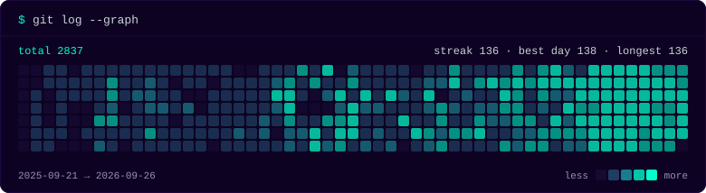

<picture>
  <source media="(prefers-color-scheme: dark)" srcset="assets/hero-dark.svg" />
  <source media="(prefers-color-scheme: light)" srcset="assets/hero-light.svg" />
  
</picture>

<picture>
  <source media="(prefers-color-scheme: dark)" srcset="assets/desk-dark.svg" />
  <source media="(prefers-color-scheme: light)" srcset="assets/desk-light.svg" />
  
</picture>

### `$ cat now.log`

<!-- NOW:START -->

<table>
<!--row:reading-->
<tr>
<td width="96"><code>reading</code></td>
<td>Isaac Newton: The Last Sorcerer (1997) &mdash; Michael White &middot; Internet Archive</td>
</tr>
<!--row:read-->
<tr>
<td width="96"><code>read</code></td>
<td>The Cult of Done Manifesto (2009) &mdash; Bre Pettis and Kio Stark &middot; designmanifestos.org<br />Kiki: Ten Thousand Years in a Lifetime (1968) &mdash; Albert Maori Kiki &middot; Internet Archive</td>
</tr>
<!--row:exploring-->
<tr>
<td width="96"><code>exploring</code></td>
<td>Claude Opus 5.5 <sub>since 23 Sep</sub> &middot; MT5 Unraided Liquidity Indicator <sub>since 23 Sep</sub> &middot; Pen and Paper Journaling <sub>since 23 Sep</sub></td>
</tr>
<!--row:explored-->
<tr>
<td width="96"><code>explored</code></td>
<td>Market Profile MT5 Indicator <sub>28 Aug &ndash; 23 Sep</sub> &middot; Claude Code Routines <sub>28 Aug &ndash; 23 Sep</sub> &middot; Scrollytelling <sub>28 Aug &ndash; 23 Sep</sub> &middot; TikTok Studio Live <sub>28 Aug &ndash; 23 Sep</sub> &middot; GLM 5.3 Flash <sub>28 Aug &ndash; 23 Sep</sub><details><summary><sub>6 older</sub></summary>OpenRouter <sub>28 Aug &ndash; 23 Sep</sub> &middot; DeepSeek Harness <sub>24 Aug &ndash; 28 Aug</sub> &middot; Ox Alpha <sub>24 Aug &ndash; 28 Aug</sub> &middot; Kimi K3 <sub>24 Aug &ndash; 28 Aug</sub> &middot; OpenCode <sub>22 Aug &ndash; 28 Aug</sub> &middot; DeepSeek V4-Flash <sub>22 Aug &ndash; 28 Aug</sub></details></td>
</tr>
<!--row:listened-->
<tr>
<td width="96"><code>listened</code></td>
<td>Greg Howe &mdash; Introspection (1993) &middot; Polyphia &mdash; Muse (2014) &middot; Van Halen &mdash; Van Halen (1978) &middot; CASIOPEA &middot; Cloudkicker</td>
</tr>
<!--row:audiobooks-->
<tr>
<td width="96"><code>currently audio books/messages</code></td>
<td>The Fear of the Lord (series) &mdash; Derek Prince &middot; YouTube<br />Book of Matthew, NKJV Audio Bible &mdash; Main Point Ministries &middot; YouTube<br />Double Decade of Open Heavens Papua New Guinea &mdash; Dr Jonathan David<br />Word Bot &middot; YouTube<br />The Fear of the Lord &mdash; Benny Hinn &middot; YouTube</td>
</tr>
<!--row:weather-->
<tr>
<td width="96"><code>weather</code></td>
<td>port moresby &middot; 24&deg;C &middot; partly cloudy &middot; 77% RH &middot; wind 17 km/h</td>
</tr>
</table>

<sub>last sync &middot; 26 Sep 2026 &middot; 00:34 GMT+10</sub>

<!-- NOW:END -->

### `$ ls ~/builds`

<table>
<tr><td><code>sym</code></td><td><code>build</code></td><td><code>★</code></td></tr>
<tr>
<td><code>GPS</code></td>
<td><a href="https://github.com/n30dyn4m1c/gold-pro-scalper">gold-pro-scalper</a><br /><sub>MQL5 &middot; z-score mean reversion, XAUUSD M1</sub></td>
<td></td>
</tr>
<tr>
<td><code>ICHI</code></td>
<td><a href="https://github.com/n30dyn4m1c/ichimoku-h4-m1-align">ichimoku-h4-m1-align</a><br /><sub>MQL5 &middot; H4&rarr;M1 cloud alignment, ATR guard</sub></td>
<td></td>
</tr>
<tr>
<td><code>MTDA</code></td>
<td><a href="https://github.com/n30dyn4m1c/mt5-deploy-agent">mt5-deploy-agent</a><br /><sub>Go &middot; git push &rarr; Wine MT5 &rarr; compiled EA</sub></td>
<td></td>
</tr>
<tr>
<td><code>SPHR</code></td>
<td><a href="https://github.com/n30dyn4m1c/360-photo-app">360-photo-app</a><br /><sub>Kotlin &middot; guided 360&deg; capture, OpenCV stitch</sub></td>
<td></td>
</tr>
<tr>
<td><code>ENSO</code></td>
<td><a href="https://github.com/n30dyn4m1c/pacificdatavizchallenge26">pacificdatavizchallenge26</a><br /><sub>Svelte &middot; El Ni&ntilde;o scrollytelling, PNG droughts</sub></td>
<td></td>
</tr>
<tr>
<td><code>CHAT</code></td>
<td><a href="https://github.com/n30dyn4m1c/upng-chatspace">upng-chatspace</a><br /><sub>TypeScript &middot; anon UPNG chat, messages die in 30m</sub></td>
<td></td>
</tr>
</table>

### `$ tail -f wire`

<!-- MEDIUM:START -->

<table>
<tr>
<td width="72"><code>25&nbsp;SEP</code></td>
<td>&rsaquo; <a href="https://medium.com/@neomalesa/voting-technology-is-a-stack-not-a-product-44abc9fa70fd">Voting Technology Is a Stack, Not a Product</a></td>
</tr>
<tr>
<td width="72"><code>22&nbsp;SEP</code></td>
<td>&rsaquo; <a href="https://medium.com/@neomalesa/the-great-southland-of-the-holy-spirit-origin-context-and-historiographical-evolution-6a81cf482765">The Great Southland of the Holy Spirit: Origin, Context, and Historiographical Evolution</a></td>
</tr>
<tr>
<td width="72"><code>22&nbsp;SEP</code></td>
<td>&rsaquo; <a href="https://medium.com/@neomalesa/the-ocean-knows-first-what-i-learned-about-el-ni%C3%B1o-while-building-this-project-d6fde9b6981e">The Ocean Knows First: What I Learned About El Niño While Building This Project</a></td>
</tr>
</table>

<sub>wire &middot; <a href="https://medium.com/@neomalesa">medium.com/@neomalesa</a></sub>

<!-- MEDIUM:END -->

### `$ which stack`

<picture>
  <source media="(prefers-color-scheme: dark)" srcset="https://skillicons.dev/icons?i=python%2Cgo%2Cts%2Ckotlin%2Csvelte%2Cdjango%2Clinux&theme=dark" />
  <source media="(prefers-color-scheme: light)" srcset="https://skillicons.dev/icons?i=python%2Cgo%2Cts%2Ckotlin%2Csvelte%2Cdjango%2Clinux&theme=light" />
  
</picture>


### `$ top`

<picture>
  <source media="(prefers-color-scheme: dark)" srcset="assets/pulse-dark.svg" />
  <source media="(prefers-color-scheme: light)" srcset="assets/pulse-light.svg" />
  
</picture>

<picture>
  <source media="(prefers-color-scheme: dark)" srcset="assets/langs-dark.svg" />
  <source media="(prefers-color-scheme: light)" srcset="assets/langs-light.svg" />
  
</picture>

<picture>
  <source media="(prefers-color-scheme: dark)" srcset="https://raw.githubusercontent.com/n30dyn4m1c/n30dyn4m1c/output/github-snake-dark.svg" />
  <source media="(prefers-color-scheme: light)" srcset="https://raw.githubusercontent.com/n30dyn4m1c/n30dyn4m1c/output/github-snake-light.svg" />
  
</picture>

<details>
<summary><code>$ man neo</code></summary>

```
NEO(1)              User Commands              NEO(1)

NAME
    neo - builds software in port moresby, png

SYNOPSIS
    neo [--dev] [--trade XAUUSD] [--write]

DESCRIPTION
    Leads in-house software development at the
    University of Papua New Guinea. Founder of
    Abide Tech. Trades gold with Ichimoku, in
    MQL5. Writes on PNG tech.

BUGS
    exploring grows faster than explored.
    known issue. wontfix.

SEE ALSO
    now.log(5), wire(1), neomalesa.com(7)
```

</details>

---

[](https://github.com/n30dyn4m1c/n30dyn4m1c/actions/workflows/now.yml)
[](https://github.com/n30dyn4m1c/n30dyn4m1c/actions/workflows/medium.yml)
[](https://github.com/n30dyn4m1c/n30dyn4m1c/actions/workflows/snake.yml)
[](https://github.com/n30dyn4m1c/n30dyn4m1c/commits)

<sub><code>pom</code> &middot; <a href="https://neomalesa.com">neomalesa.com</a> &middot; <a href="https://n30dyn4m1c.github.io/abide-tech/">abide tech</a> &middot; <a href="https://medium.com/@neomalesa">medium</a> &middot; <a href="https://x.com/n30dyn4m1c">x</a></sub>

<!-- This work is my worship unto GOD -->
